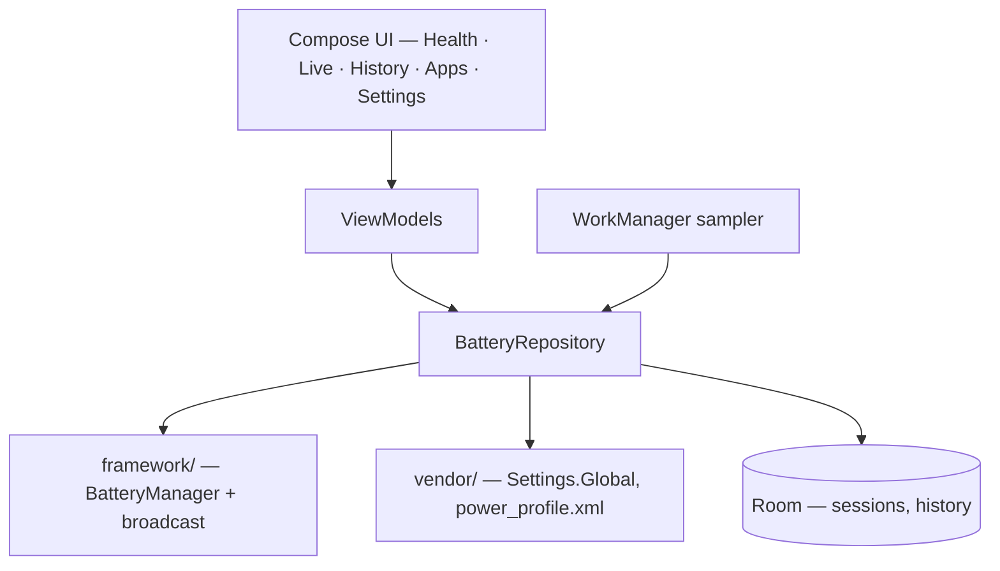

<div align="center">


# Battery Health — Developer Guide

**Measure what Android will not tell you — an Android app that derives real battery capacity from charge-counter sampling, self-sufficient by design: no adb, no root, no shell, no companion app. Every capability comes from a normal Android permission flow or a public API, or it is reported as unavailable rather than faked.**

[](https://developer.android.com/)
[](https://kotlinlang.org/)
[](https://developer.android.com/jetpack/compose)
[](https://m3.material.io/)
[](https://developer.android.com/training/data-storage/room)
[](https://dagger.dev/hilt/)
[](LICENSE)

</div>

## What it is

Every battery app claims to show you state of health. Almost none of them can read it —
Android does not expose it, so the number has to come from somewhere, and "somewhere" is
usually a guess dressed up as a measurement.

This app takes the opposite position. It states plainly which numbers the platform withholds,
**measures** the ones it can rather than inventing them, and reports a metric as unavailable
when the measurement is not trustworthy — never as a plausible-looking number.

Where a metric genuinely does sit behind a permission this app cannot obtain through a normal
install — `BATTERY_STATS` is `signature|privileged|development`, grantable only by `adb shell
pm grant` — the app does not pretend otherwise, and it does not ask anyone to connect a
computer or root their phone to get it either. It reports the absence honestly and moves on.
An earlier version of this app carried a hand-rolled ADB client and a root shell to reach those
numbers anyway; both are gone. The owner's decision, stated plainly: this app never instructs
anyone to run a shell command, on this device or any other. Every capability it has comes from
a public API or a permission granted the ordinary Android way — a runtime dialog, or a deep
link to the right system settings screen.

## What it can and cannot know

Android exposes very little battery data to an unprivileged app, and the numbers users most
want are the ones it withholds. This matters enough to state up front, because it shapes the
whole design.

**Readable by any app:** charge level, voltage, current, temperature, technology, charge
counter, and charge-time-remaining.

**Not readable by any unprivileged app, on any device:** first-use date and manufacturing date.
Both sit behind `BATTERY_STATS`, a signature-level permission this app can never be granted
through a normal install, and both are `@SystemApi @hide`, so their constants appear in no
public SDK. Verified against real hardware, not assumed from API levels. State of health is a
partial exception: AOSP checks a platform "state of health is public" flag before enforcing
`BATTERY_STATS` on that one property, so on a build/device where that flag is set, this app
reads it with no permission at all — see `FrameworkStateOfHealth`.

Consequently the app **measures** health rather than reading it: it samples the charge counter
across charge sessions and derives full capacity, comparing against a design capacity looked
up from `Build.MODEL`. Every guard in that calculation exists to stop a specific way it could
produce a confident wrong answer — narrow charge windows are rejected, the median of several
sessions is used rather than the latest, a charge counter synthesised from the level is
detected and refused, and an implausible result is reported as unavailable rather than clamped
into a believable-looking number.

First-use date, manufacturing date and Samsung's own BSOH figure report "not available on this
device" rather than a permission-denied state: this app has no route left to unlock any of
them, so inviting the user to try would be a promise it cannot keep.

## Features

**Measurement**
- **State of health** derived from charge-counter deltas across real charge sessions, not from
  a vendor string
- Design capacity resolved from `Build.MODEL` against a curated table, falling back to the
  device's own `power_profile.xml` declaration where the table doesn't know the model; a
  device neither source can answer degrades to unavailable rather than to a default or a
  typed-in guess — there is no override field left for the user to fill one in
- Median-of-sessions rather than latest-session, so one bad charge cannot move the headline
- Synthesised charge counters (level × nominal capacity) detected and refused

**Live and history**
- Live view — level, voltage, current, temperature, technology, charge-time-remaining
- History persisted in Room with exported schemas and real migrations; destructive migration is
  prohibited, because recorded history is the only data here that cannot be recomputed
- Background sampling via WorkManager, surviving reboot

**Self-sufficient by design — no adb, no root, no shell, no companion app**
- Every permission this app declares can be granted the normal Android way: `POST_NOTIFICATIONS`
  through a real runtime dialog, `PACKAGE_USAGE_STATS` through a deep link to the system's own
  Usage access screen. Everything else is install-time, granted automatically, with nothing for
  the user to do
- No permission this app declares is `signature`, `privileged` or `development` protection
  level — every one of those was removed because a real end user installing from Play could
  never grant it, only a computer running `adb shell pm grant` could
- The Settings screen's Permissions section lists every permission the app declares, its live
  state, and the one action (if any) that advances it — never a shell command
- An earlier version of this app carried a hand-rolled ADB wire-protocol client and a root
  shell to reach permission-gated `dumpsys` output. Both, and everything that consumed their
  output, are gone

**Honesty by construction**
- Every metric reaches the UI wrapped in `Reading<T>` — either a value plus its provenance, or a
  specific reason for absence
- `ReadingSlot` is the only sanctioned way to render one, and it invokes its content lambda
  solely for available readings, so a missing metric cannot be styled as data by accident
- The user-facing copy explaining *why* a reading is missing is pinned by tests, so a copy edit
  cannot quietly turn a transient failure into a claimed permission denial

## Architecture



```
app/src/main/java/com/alaminahamed/batteryhealth/
├── MainActivity.kt          Entry point; installs the splash screen
├── BatteryHealthApplication.kt
├── domain/                  Reading<T>, BatterySnapshot, HealthReport, ChargeSession
├── data/
│   ├── framework/           Battery broadcast + BatteryManager sources, capability probe
│   ├── local/               Room entities, DAOs, database
│   ├── settings/            DataStore preferences, design-capacity table
│   └── repo/                BatteryRepository, HealthEstimator, CycleCountResolver
├── sampling/                WorkManager sampler + boot receiver
├── di/                      Hilt modules
└── ui/
    ├── nav/                 Destinations and NavHost
    ├── health/  live/  history/  apps/  settings/    Screens and their UI state
    ├── charts/  format/                   Rendering helpers
    ├── components/          One UI card/row/metric primitives, ReadingSlot
    └── theme/               Tokens, typography, BatteryHealthTheme
```

- `applicationId` / `namespace`: `com.alaminahamed.batteryhealth`
- UI is entirely Jetpack Compose with Material 3; there are no XML layouts beyond the splash
  theme
- Dynamic colour is deliberately off — the fixed Samsung blue is the product identity

## Requirements

| Tool                   | Version                                 |
|------------------------|-----------------------------------------|
| JDK                    | 25 (Android Studio's bundled JBR works) |
| Android Gradle Plugin  | 9.3.1                                   |
| Gradle                 | 9.7.0 (via wrapper)                     |
| Kotlin                 | 2.4.10                                  |
| compileSdk / targetSdk | 37                                      |
| minSdk                 | 26 (Android 8.0)                        |

Dependencies are AndroidX/Google/Kotlin only and track their latest stable versions; see
`gradle/libs.versions.toml`. There are deliberately **no third-party dependencies**.

## Installation

Clone the repo and create `local.properties` pointing at your Android SDK — the file is
intentionally untracked:

```properties
sdk.dir=/Users/<you>/Library/Android/sdk
```

Open the project in Android Studio and let Gradle sync; the version catalog configures the
rest. To build from a shell, the wrapper needs a JDK on `PATH`:

```bash
export JAVA_HOME="/Applications/Android Studio.app/Contents/jbr/Contents/Home"
export PATH="$JAVA_HOME/bin:$PATH"
```

### Building

One variant, so Gradle task names are unqualified:

```bash
./gradlew installDebug                 # build and install
./gradlew assembleDebug                # build without installing
./gradlew testDebugUnitTest            # host-side unit tests
./gradlew connectedDebugAndroidTest    # instrumented tests on a connected device
```

The app used to ship as two flavours, `play` and `full`, differing only in whether they
declared `QUERY_ALL_PACKAGES` to resolve app names for the Apps screen. That screen is gone, so
the split had nothing left to distinguish and was collapsed.

### Permissions

There is no route to unlock first-use date, manufacturing date or Samsung's BSOH figure —
none exists any more. `BATTERY_STATS`, the signature-level permission that used to gate a
`BatteryManager`-direct read of two of those, is not declared: it is `adb`-grant-only, and
this app never instructs anyone to run a shell command, so declaring a permission it can
never hold would be asking for nothing.

What the app *can* ask for, it asks for the normal way, and the Settings screen's own
Permissions section shows the live state of every one of them:

- **`POST_NOTIFICATIONS`** — a real runtime dialog
- **`PACKAGE_USAGE_STATS`** — appop-gated; the app deep-links to the system's Usage access
  screen, where the user flips it on themselves
- Everything else the app declares (`FOREGROUND_SERVICE`, `FOREGROUND_SERVICE_SPECIAL_USE`,
  `RECEIVE_BOOT_COMPLETED`) is install-time, granted automatically, with nothing to tap

Without state of health, both dates and BSOH, the app still measures health from the charge
counter, counts cycles from the charge it records (or from the battery broadcast's own
`EXTRA_CYCLE_COUNT`, where a device reports one), and reads Battery Protect and its charge
limit from `Settings.Global` — none of which needs anything beyond what is listed above.

## Development

```bash
./gradlew testDebugUnitTest          # host-side unit tests
./gradlew connectedDebugAndroidTest  # instrumented tests on a connected device
```

Two things that will otherwise cost you time:

- `connectedDebugAndroidTest` does **not** accept `--tests`. Filter with
  `-Pandroid.testInstrumentationRunnerArguments.class=<fully.qualified.ClassName>`
- The device must be awake and unlocked, or Compose tests fail with a misleading
  "No compose hierarchies found". Run
  `adb shell input keyevent KEYCODE_WAKEUP && adb shell wm dismiss-keyguard` first
- The connected-test task **uninstalls the app** when it finishes. Reinstall before launching
  it by hand

Launch the installed app from a shell:

```bash
adb shell am start -n com.alaminahamed.batteryhealth/.MainActivity
```

### Release builds

R8 is enabled for the release build type; project-specific keep rules live in
`app/src/main/keepRules/` and AGP discovers them automatically.

Release signing reads from `keystore.properties` at the repo root, falling back to the
environment so CI needs no file on disk. Copy the template and fill it in:

```bash
cp keystore.properties.example keystore.properties

keytool -genkeypair -v -keystore upload-keystore.jks -alias upload \
        -keyalg RSA -keysize 4096 -validity 10000
```

`keystore.properties`, `*.jks` and `*.keystore` are gitignored. **Back the keystore up
somewhere outside this repository** — losing it means losing the ability to publish updates
under the same app identity. The CI equivalents are `RELEASE_STORE_FILE`,
`RELEASE_STORE_PASSWORD`, `RELEASE_KEY_ALIAS` and `RELEASE_KEY_PASSWORD`.

> **With no credentials configured, release builds are produced unsigned** — `assemblePlayRelease`
> emits `app-release-unsigned.apk`. That is deliberate: the alternative, falling back to
> the debug key, yields an artifact Play rejects at upload and that is easy to ship somewhere
> by accident. An artifact that cannot be installed is the cheaper mistake.

Google Play needs the bundle, not the APK:

```bash
./gradlew :app:bundleRelease   # app/build/outputs/bundle/release/app-release.aab
```

## Verified on

- **Samsung Galaxy A35 5G (SM-A356E), Android 16 (API 36)** — the battery API behaviour this
  app is built on: which fields the platform exposes, which are `@SystemApi @hide`, and what
  `dumpsys` actually returns. The captured fixtures under `app/src/test/resources/` come from
  this device.
- **Samsung Galaxy S26 Ultra (SM-S948B), Android 16 (API 36)** — an earlier version of this
  app verified the now-removed privileged tier end to end here: cycle count, BSOH, both
  dates and Battery Protect's fields all read correctly over a granted `BATTERY_STATS` and
  a connected shell. None of that is reachable any more — see the task history for why —
  but the discovery sweep's output across all five channels still comes from this device.

  Two findings from it are load-bearing elsewhere in the codebase. `power_profile.xml`
  carries **both** `battery.capacity` (4855, the rated figure) and Samsung's own
  `battery.typical.capacity` (5000) — reading AOSP's field would over-report health by
  about 3% on every Samsung. And `Settings.Global.battery_protection_threshold` (95)
  mirrors `mMaximumProtectionThreshold`, the Maximum-mode ceiling, not the
  `mProtectionThreshold` (80) actually in force.

`DesignCapacityTable` covers the A34/A35/A36/A54/A55/A56, the S23, S24 and S25 series, the S26
Ultra, and the Pixel 9 Pro. Entries are only added when the figure can be sourced with
confidence — the S26 Ultra's 5000 mAh is corroborated by the device's own readings, a 4205 mAh
charge counter at level 84% implying a full charge near 5006 mAh — because a wrong entry
silently corrupts every health percentage the app shows, which is worse than reporting
unavailable.

Design capacities are looked up per `Build.MODEL` (or, for a handful of vendors whose model
strings are unreliable, `Build.DEVICE`) against the table first, then against the device's
own `power_profile.xml` declaration where the table doesn't know the model. A device neither
source can answer reports state of health as unavailable — there is no field left for a user
to type a capacity into; see `DesignCapacityProvider`'s own doc for the cost of that removal.

## Contributing

Branch from `trunk`, keep the full gate green, and open a pull request. Commit subjects are
imperative and sentence-case, with no `type:` prefix.

Two conventions are load-bearing rather than stylistic:

- **A test must be shown failing before its fix.** A test that cannot be demonstrated to go red
  when the property breaks is not evidence that the property holds
- **The app never instructs anyone to run a shell command.** Every capability comes from a
  public API or a permission granted the ordinary Android way. Do not reintroduce adb, root,
  or a field asking the user to type a number the device itself should have supplied

## License

MIT — see [LICENSE](LICENSE).
