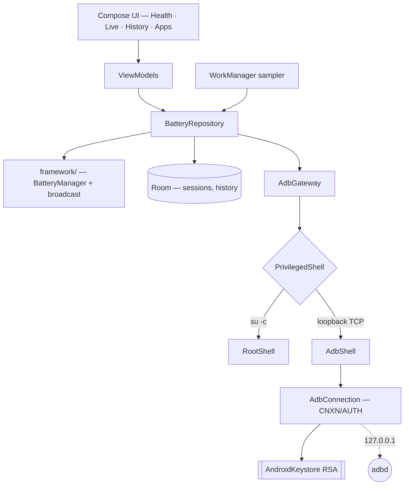

<div align="center">


# Battery Health — Developer Guide

**Measure what Android will not tell you — an Android app that derives real battery capacity from charge-counter sampling, and reaches the metrics the platform hides through an ADB client it speaks itself, with no companion app and no third-party dependency.**

[](https://developer.android.com/)
[](https://kotlinlang.org/)
[](https://developer.android.com/jetpack/compose)
[](https://m3.material.io/)
[](https://developer.android.com/training/data-storage/room)
[](https://dagger.dev/hilt/)
[](LICENSE)

</div>

## What it is

Every battery app claims to show you state of health. Almost none of them can read it —
Android does not expose it, so the number has to come from somewhere, and "somewhere" is
usually a guess dressed up as a measurement.

This app takes the opposite position. It states plainly which numbers the platform withholds,
**measures** the ones it can rather than inventing them, and reports a metric as unavailable
when the measurement is not trustworthy — never as a plausible-looking number.

Where a metric genuinely does sit behind a privileged permission, the app does not give up and
does not ask you to install a helper app either. It implements the **ADB wire protocol
directly** — the same `CNXN`/`AUTH` handshake `adb connect` performs, an RSA key held
non-exportably in the Android Keystore — and talks to your own device's `adbd` over loopback.
On a rooted device it uses `su` instead. Either way the privileged surface is a fixed
allowlist of two commands; nothing you type ever reaches a shell.

## What it can and cannot know

Android exposes very little battery data to an unprivileged app, and the numbers users most
want are the ones it withholds. This matters enough to state up front, because it shapes the
whole design.

**Readable by any app:** charge level, voltage, current, temperature, technology, charge
counter, and charge-time-remaining.

**Not readable by any unprivileged app, on any device:** state of health, first-use date, and
manufacturing date. All three sit behind `BATTERY_STATS`, a signature-level permission, and
two of them are `@SystemApi @hide`, so their constants appear in no public SDK. Verified
against real hardware, not assumed from API levels.

Consequently the app **measures** health rather than reading it: it samples the charge counter
across charge sessions and derives full capacity, comparing against a design capacity looked
up from `Build.MODEL`. Every guard in that calculation exists to stop a specific way it could
produce a confident wrong answer — narrow charge windows are rejected, the median of several
sessions is used rather than the latest, a charge counter synthesised from the level is
detected and refused, and an implausible result is reported as unavailable rather than clamped
into a believable-looking number.

Metrics that need the privileged tier report "needs privileged access" rather than
"unavailable on this device", because a permission denial is not a hardware limitation.

## Features

**Measurement**
- **State of health** derived from charge-counter deltas across real charge sessions, not from
  a vendor string
- Design capacity resolved from `Build.MODEL`; an unknown model degrades to unavailable rather
  than to a default
- Median-of-sessions rather than latest-session, so one bad charge cannot move the headline
- Synthesised charge counters (level × nominal capacity) detected and refused

**Live and history**
- Live view — level, voltage, current, temperature, technology, charge-time-remaining
- History persisted in Room with exported schemas and real migrations; destructive migration is
  prohibited, because recorded history is the only data here that cannot be recomputed
- Background sampling via WorkManager, surviving reboot

**Privileged tier — no companion app, no third-party dependency**
- A hand-rolled **ADB client**: 24-byte wire framing, `CNXN`/`AUTH` handshake, `OPEN`/`OKAY`/
  `WRTE`/`CLSE` streams, `ANDROID_PUBKEY` encoding — all over `127.0.0.1`
- RSA key generated **non-exportably in the AndroidKeystore**; signing uses `NONEwithRSA` over
  the pre-digested token, so the key never leaves hardware and there is no file fallback
- **Root transport** via `su` where available, preferred over ADB when both are ready
- **Fixed allowlist**: exactly two commands (`dumpsys battery`, `dumpsys batterystats --checkin`)
  are `const val`. No method takes a command string — the restriction is structural, not a filter
- `INTERNET` is declared for loopback only, and a unit test fails the build if any production
  source constructs a socket that could reach anywhere else

**Honesty by construction**
- Every metric reaches the UI wrapped in `Reading<T>` — either a value plus its provenance, or a
  specific reason for absence
- `ReadingSlot` is the only sanctioned way to render one, and it invokes its content lambda
  solely for available readings, so a missing metric cannot be styled as data by accident
- The user-facing copy explaining *why* a reading is missing is pinned by tests, so a copy edit
  cannot quietly turn a transient failure into a claimed permission denial

## Architecture



```
app/src/main/java/com/alaminahamed/batteryhealth/
├── MainActivity.kt          Entry point; installs the splash screen
├── BatteryHealthApplication.kt
├── domain/                  Reading<T>, BatterySnapshot, HealthReport, ChargeSession
├── data/
│   ├── framework/           Battery broadcast + BatteryManager sources, capability probe
│   ├── local/               Room entities, DAOs, database
│   ├── settings/            DataStore preferences, design-capacity table
│   ├── apps/                Per-app label resolution (flavour-specific)
│   ├── privileged/          Transport seam, state reducer, dumpsys parsers
│   │   └── adb/             Wire framing, key encoding, handshake, streams
│   └── repo/                BatteryRepository, HealthEstimator, CycleCountResolver
├── sampling/                WorkManager sampler + boot receiver
├── di/                      Hilt modules
└── ui/
    ├── nav/                 Destinations and NavHost
    ├── health/  live/  history/  apps/    Screens and their UI state
    ├── charts/  format/                   Rendering helpers
    ├── components/          One UI card/row/metric primitives, ReadingSlot, UnlockCard
    └── theme/               Tokens, typography, BatteryHealthTheme
```

- `applicationId` / `namespace`: `com.alaminahamed.batteryhealth`
- UI is entirely Jetpack Compose with Material 3; there are no XML layouts beyond the splash
  theme
- Dynamic colour is deliberately off — the fixed Samsung blue is the product identity

## Requirements

| Tool                   | Version                                 |
|------------------------|-----------------------------------------|
| JDK                    | 25 (Android Studio's bundled JBR works) |
| Android Gradle Plugin  | 9.3.1                                   |
| Gradle                 | 9.7.0 (via wrapper)                     |
| Kotlin                 | 2.4.10                                  |
| compileSdk / targetSdk | 37                                      |
| minSdk                 | 26 (Android 8.0)                        |

Dependencies are AndroidX/Google/Kotlin only and track their latest stable versions; see
`gradle/libs.versions.toml`. There are deliberately **no third-party dependencies** — the
privileged tier that would normally justify one is implemented in this repo instead.

## Installation

Clone the repo and create `local.properties` pointing at your Android SDK — the file is
intentionally untracked:

```properties
sdk.dir=/Users/<you>/Library/Android/sdk
```

Open the project in Android Studio and let Gradle sync; the version catalog configures the
rest. To build from a shell, the wrapper needs a JDK on `PATH`:

```bash
export JAVA_HOME="/Applications/Android Studio.app/Contents/jbr/Contents/Home"
export PATH="$JAVA_HOME/bin:$PATH"
```

### Build flavours

There are two, so **every Gradle task name is flavour-qualified**:

- **`play`** (default) — omits `QUERY_ALL_PACKAGES`, keeping it out of a Play submission
- **`full`** — declares it, so per-app battery attribution can resolve app names and icons

```bash
./gradlew installFullDebug             # or installPlayDebug for the Play-safe flavour
./gradlew assemblePlayDebug            # build without installing
```

### Enabling the privileged tier

The app raises Android's own "Allow USB debugging?" prompt and remembers the grant afterwards.
Before it can connect, `adbd` has to be listening on TCP — a one-time step from a computer:

```bash
adb tcpip 5555
```

On most devices that does **not** survive a reboot, so the command has to be repeated after a
restart. A rooted device skips this entirely and uses `su`.

## Development

```bash
./gradlew testPlayDebugUnitTest          # host-side unit tests
./gradlew connectedPlayDebugAndroidTest  # instrumented tests on a connected device
```

Two things that will otherwise cost you time:

- `connectedPlayDebugAndroidTest` does **not** accept `--tests`. Filter with
  `-Pandroid.testInstrumentationRunnerArguments.class=<fully.qualified.ClassName>`
- The device must be awake and unlocked, or Compose tests fail with a misleading
  "No compose hierarchies found". Run
  `adb shell input keyevent KEYCODE_WAKEUP && adb shell wm dismiss-keyguard` first
- The connected-test task **uninstalls the app** when it finishes. Reinstall before launching
  it by hand

Launch the installed app from a shell:

```bash
adb shell am start -n com.alaminahamed.batteryhealth/.MainActivity
```

### Release builds

R8 is enabled for the release build type; project-specific keep rules live in
`app/src/main/keepRules/` and AGP discovers them automatically.

Release signing reads from `keystore.properties` at the repo root, falling back to the
environment so CI needs no file on disk. Copy the template and fill it in:

```bash
cp keystore.properties.example keystore.properties

keytool -genkeypair -v -keystore upload-keystore.jks -alias upload \
        -keyalg RSA -keysize 4096 -validity 10000
```

`keystore.properties`, `*.jks` and `*.keystore` are gitignored. **Back the keystore up
somewhere outside this repository** — losing it means losing the ability to publish updates
under the same app identity. The CI equivalents are `RELEASE_STORE_FILE`,
`RELEASE_STORE_PASSWORD`, `RELEASE_KEY_ALIAS` and `RELEASE_KEY_PASSWORD`.

> **With no credentials configured, release builds are produced unsigned** — `assemblePlayRelease`
> emits `app-play-release-unsigned.apk`. That is deliberate: the alternative, falling back to
> the debug key, yields an artifact Play rejects at upload and that is easy to ship somewhere
> by accident. An artifact that cannot be installed is the cheaper mistake.

Google Play needs the bundle, not the APK:

```bash
./gradlew :app:bundlePlayRelease   # app/build/outputs/bundle/playRelease/app-play-release.aab
```

## Verified on

- **Samsung Galaxy A35 5G (SM-A356E), Android 16 (API 36)** — the battery API behaviour this
  app is built on: which fields the platform exposes, which are `@SystemApi @hide`, and what
  `dumpsys` actually returns. The captured fixtures under `app/src/test/resources/` come from
  this device.
- **Samsung Galaxy S26 Ultra (SM-S948B), Android 16 (API 36)** — install, launch, and the
  one-time `adb tcpip 5555` setup path, confirmed over wireless debugging. The privileged tier
  itself has **not** been exercised end to end on hardware yet.

`DesignCapacityTable` covers the A34/A35/A54/A55 and the S23 and S24 series. On a model it
does not know, the app reports state of health as unavailable rather than guessing a design
capacity — correct behaviour, but it does mean the headline metric is blank until either the
table grows or the user supplies an override.

Design capacities are looked up per `Build.MODEL`; a model that is not in the table reports
state of health as unavailable rather than guessing.

## Contributing

Branch from `trunk`, keep the full gate green, and open a pull request. Commit subjects are
imperative and sentence-case, with no `type:` prefix.

Two conventions are load-bearing rather than stylistic:

- **A test must be shown failing before its fix.** A test that cannot be demonstrated to go red
  when the property breaks is not evidence that the property holds
- **The privileged surface stays an allowlist.** Never add a method that takes a command string,
  not even in debug builds

## License

MIT — see [LICENSE](LICENSE).
